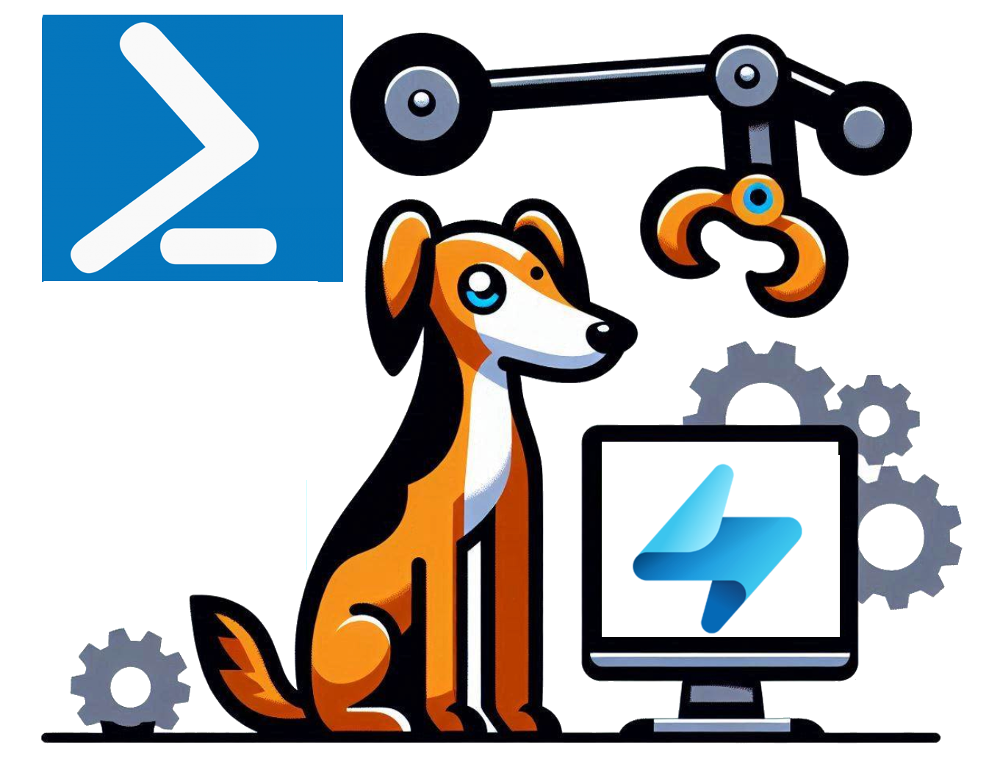

# powerrti

 

Welcome to Power-RTI! This is a PowerShell Module that can help automate creating and managing Real-Time Intelligence Environments. The repository is a curated collection of PowerShell cmdlets to help you to standardize management and provisioning of Fabric RTI resources.

<!-- markdownlint-disable MD033 -->

  

    
    
     
  

<!-- markdownlint-enable MD033 -->

Sending KQL Commands to a KQL-Database is a little bit complex so I wrote an article on how to do this. The article can be found [here](./documentation/querying-a-kql-database.md).

## Contribution Guidelines

We warmly welcome contributions from the community! Your expertise and insights help keep this library robust, up-to-date, and relevant. To contribute:

1. **Open an Issue:** If you discover a bug, require a new feature, or want to propose an enhancement, please open a GitHub Issue.

2. **Fork the Repository:** Make changes in a dedicated branch of your forked repository.

3. **Write Clear Documentation & Tests:** Ensure your code is thoroughly documented and includes test cases where applicable.

4. **Submit a Pull Request:** Once your changes are complete, open a Pull Request (PR) for review. Include details on what was changed, why it’s important, and how to test it.

5. **Address Feedback:** Our maintainers and community members will review your PR. Please be open to feedback and responsive to requested changes.

For more detailed guidelines, including style conventions, code quality standards, and testing procedures, refer to the documentation [Contributing to PowerRTI](./documentation/contributing.md) file.

## Generating the documentation

The documentation for the cmdlets is created through [platyPS](https://github.com/PowerShell/platyPS) and is stored in the folder [documentation](./documentation/). This documentation will be created automatically by running the script [createdocumentation.ps1](./helper/createdocumentation.ps1).

| :heavy_exclamation_mark: **Important**                                                                                                                                                                                                |
| :------------------------------------------------------------------------------------------------------------------------------------------------------------------------------------------------------------------------------------ |
| **The documentation will be created from the module which was loaded into PowerShell. It will not be created from the files directly. All what is needed is in the file [createdocumentation.ps1](./helper/createdocumentation.ps1)** |

## Interesting Links for reference

During the development of the module and the research I do I might pass some interesting documentation. I collect it here for reference.

- [Powershell: Building a Module, one microstep at a time](https://powershellexplained.com/2017-05-27-Powershell-module-building-basics/)
- [Automating Real-Time Intelligence Eventhouse deployment using PowerShell](https://blog.fabric.microsoft.com/en/blog/automating-real-time-intelligence-eventhouse-deployment-using-powershell?ft=04-2024:date)
- [Generating PowerShell module documentation with platyPS](https://mikefrobbins.com/2023/11/30/generating-powershell-module-documentation-with-platyps/)
- [How to Write a PowerShell Script Module](https://learn.microsoft.com/en-us/powershell/scripting/developer/module/how-to-write-a-powershell-script-module?view=powershell-7.4)
- [Microsoft Fabric REST API documentation](https://learn.microsoft.com/en-us/rest/api/fabric/articles/)
- [FabricRTI_Accelerator](https://github.com/SuryaTejJosyula/FabricRTI_Accelerator/tree/main)
- [How I Implement Module Variables](https://thedavecarroll.com/powershell/how-i-implement-module-variables/)
- [Everything you wanted to know about exceptions](https://learn.microsoft.com/en-us/powershell/scripting/learn/deep-dives/everything-about-exceptions?view=powershell-7.4)
- [PowerShell ValidateSet: Tab-Completion & Parameter Values](https://adamtheautomator.com/powershell-validateset/)
- [about_Comment_Based_Help](https://learn.microsoft.com/en-us/powershell/module/microsoft.powershell.core/about/about_comment_based_help?view=powershell-5.1)
- [Examples of Comment-based Help](https://learn.microsoft.com/en-us/powershell/scripting/developer/help/examples-of-comment-based-help?view=powershell-7.4)
- [Using PSScriptAnalyzer](https://learn.microsoft.com/en-us/powershell/utility-modules/psscriptanalyzer/using-scriptanalyzer?view=ps-modules)
- [Querying Fabric KQL Database Using REST API](https://fabric.guru/querying-fabric-kql-database-using-rest-api)
- [How to Use GitHub Action for GitHub Push in Your Workflows](https://cicube.io/workflow-hub/ad-m-github-push-action/#how-to-use-a-github-app-token-for-pushing-changes)
- [Shields.io](https://shields.io)
- [shields.io Snippets](https://marketplace.visualstudio.com/items?itemName=relliv.shieldsio-snippets)
- [How to use Custom Objects (PSCustomObject) in PowerShell?](https://www.sharepointdiary.com/2021/08/custom-objects-in-powershell.html)

## Questions

In this section I just collect questions that I stumble upon and that have to be addressed somehow.

- Is there no New-Command for KQLQuerysets?
- Why do you need admin permission to read the workspaces?
