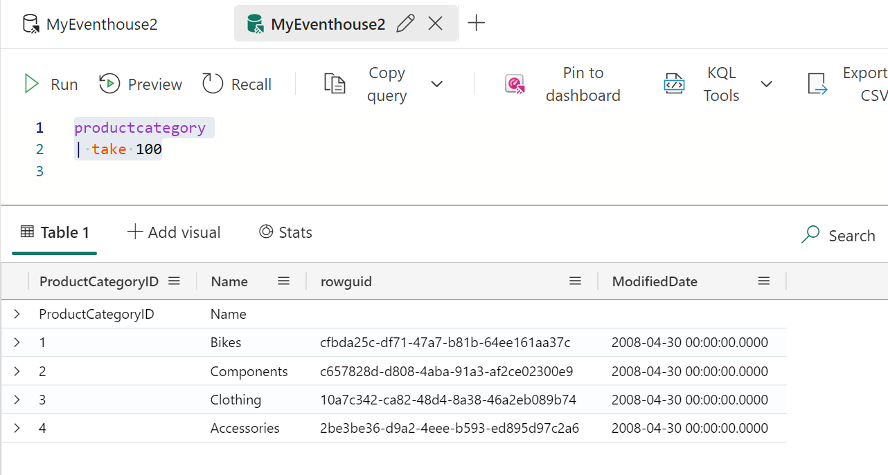

# Querying a KQL database from PowerShell

Because querying a KQL Database from Powershell is not as easy and straight forward as one would expect I write this article where I lay down all of my experiences during developing the [Invoke-RtiKQLCommand](/documentation/Invoke-RtiKQLCommand.md) cmdlet. For sure it can be that I am somewhere wrong and that I do things in the most awful and cumbersome way. If so I would be more than happy to learn what I have done wrong and what I can possibly improve. So if there is some oddity going on here please do not shy away from commenting, sending pull requests or write an issue. This is what this repo is for - right?

## Distinction between Management and Query Commands in KQL

In comparison to SQL there is obviously a distinction between Management and Query Commands in KQL. I am well aware of the fact that the SQL language is devided into different languages as well like DML, DDL and so on. Main difference from my point of view is that different commands have to be sent to different endpoints. Commands that will change the structure of the Database (Data Definition Language Commands) are sent to

```url
https://<id-of-database>.kusto.fabric.microsoft.com/v1/rest/mgmt
```

whereas query commands are sent to

```url
https://<id-of-database>.kusto.fabric.microsoft.com/v1/rest/query
```

Furthermore DDL commands have to be sourrounded by the following statement if sent to the management endpoint

```kql
.execute database script <|
<your script here>
```

You can read everything about `.execute database.script` [here](https://learn.microsoft.com/en-us/kusto/management/execute-database-script?view=microsoft-fabric)

My cmdlet [Invoke-RtiKQLCommand](/documentation/Invoke-RtiKQLCommand.md) implements the following logic: If the command that is included in the parameter `-KQLCommand` starts with a dot, this KQL command is considered as a command that has to be started by `execute database script` and sent to the management endpoint whereas everything else is sent to the query endpoint.

| :notebook: **Note**                                                                                                      |
| :----------------------------------------------------------------------------------------------------------------------- |
| **I found this out by solely experimenting and reading some articles on the internet. If this is wrong please correct.** |

## Resuls that we get back if we send a query to the query endpoint

In this section I will write down my experiences with querying the query endpoint within PowerShell. To make things as easy and understandable as possible I use the following query during my experiments:

```kql
productcategory
| take 100
```

As testdata I uploaded the csv-file [productcategory.csv](https://github.com/microsoft/FabConRTITutorial/blob/main/ref_data/productcategory.csv) from our RTI Tutorial to a KQL Database. This one is quick and easy because it only has 4 rows of data and four columns, the column `ProductCategoryID`, the column `Name`, the column `rowguid` and the column `modified_date`. This looks like:



The result of my experiment is:

```json
  "Tables": [
    {
      "TableName": "Table_0",
      "Columns": [
        {
          "ColumnName": "ProductCategoryID",
          "DataType": "String",
          "ColumnType": "string"
        },
        {
          "ColumnName": "Name",
          "DataType": "String",
          "ColumnType": "string"
        },
        {
          "ColumnName": "rowguid",
          "DataType": "Guid",
          "ColumnType": "guid"
        },
        {
          "ColumnName": "ModifiedDate",
          "DataType": "DateTime",
          "ColumnType": "datetime"
        }
      ],
      "Rows": [
        [
          "ProductCategoryID",
          "Name",
          null,
          null
        ],
        [
          "1",
          "Bikes",
          "cfbda25c-df71-47a7-b81b-64ee161aa37c",
          "2008-04-30T00:00:00Z"
        ],
        [
          "2",
          "Components",
          "c657828d-d808-4aba-91a3-af2ce02300e9",
          "2008-04-30T00:00:00Z"
        ],
        [
          "3",
          "Clothing",
          "10a7c342-ca82-48d4-8a38-46a2eb089b74",
          "2008-04-30T00:00:00Z"
        ],
        [
          "4",
          "Accessories",
          "2be3be36-d9a2-4eee-b593-ed895d97c2a6",
          "2008-04-30T00:00:00Z"
        ]
      ]
    },
    {
      "TableName": "Table_1",
      "Columns": [
        {
          "ColumnName": "Value",
          "DataType": "String",
          "ColumnType": "string"
        }
      ],
      "Rows": [
        [
          "{\"Visualization\":null,\"Title\":null,\"XColumn\":null,\"Series\":null,\"YColumns\":null,\"AnomalyColumns\":null,\"XTitle\":null,\"YTitle\":null,\"XAxis\":null,\"YAxis\":null,\"Legend\":null,\"YSplit\":null,\"Accumulate\":false,\"IsQuerySorted\":false,\"Kind\":null,\"Ymin\":\"NaN\",\"Ymax\":\"NaN\",\"Xmin\":null,\"Xmax\":null}"
        ]
      ]
    },
    {
      "TableName": "Table_2",
      "Columns": [
        {
          "ColumnName": "Timestamp",
          "DataType": "DateTime",
          "ColumnType": "datetime"
        },
        {
          "ColumnName": "Severity",
          "DataType": "Int32",
          "ColumnType": "int"
        },
        {
          "ColumnName": "SeverityName",
          "DataType": "String",
          "ColumnType": "string"
        },
        {
          "ColumnName": "StatusCode",
          "DataType": "Int32",
          "ColumnType": "int"
        },
        {
          "ColumnName": "StatusDescription",
          "DataType": "String",
          "ColumnType": "string"
        },
        {
          "ColumnName": "Count",
          "DataType": "Int32",
          "ColumnType": "int"
        },
        {
          "ColumnName": "RequestId",
          "DataType": "Guid",
          "ColumnType": "guid"
        },
        {
          "ColumnName": "ActivityId",
          "DataType": "Guid",
          "ColumnType": "guid"
        },
        {
          "ColumnName": "SubActivityId",
          "DataType": "Guid",
          "ColumnType": "guid"
        },
        {
          "ColumnName": "ClientActivityId",
          "DataType": "String",
          "ColumnType": "string"
        }
      ],
      "Rows": [
        [
          "2024-12-27T12:18:55.556684Z",
          4,
          "Info",
          0,
          "Query completed successfully",
          1,
          "5ca38db6-f22c-4e57-96b5-dd0c5378491f",
          "5ca38db6-f22c-4e57-96b5-dd0c5378491f",
          "7262e11e-a3d7-413b-8d3a-fe56eb6a395b",
          "unspecified;61a0a8b2-dc13-4c90-9a23-91c452f028bd"
        ],
        [
          "2024-12-27T12:18:55.556684Z",
          6,
          "Stats",
          0,
          "{\"QueryHash\":\";;d42647b3da39c7f1\",\"ExecutionTime\":0.0,\"resource_usage\":{\"cache\":{\"shards\":{\"hot\":{\"hitbytes\":844,\"missbytes\":0,\"retrievebytes\":0},\"cold\":{\"hitbytes\":0,\"missbytes\":0,\"retrievebytes\":0},\"bypassbytes\":0}},\"cpu\":{\"user\":\"00:00:00\",\"kernel\":\"00:00:00\",\"total cpu\":\"00:00:00\",\"breakdown\":{\"query execution\":\"00:00:00\",\"query planning\":\"00:00:00\"}},\"memory\":{\"peak_per_node\":3146448},\"network\":{\"inter_cluster_total_bytes\":862,\"cross_cluster_total_bytes\":0}},\"input_dataset_statistics\":{\"extents\":{\"total\":1,\"scanned\":1,\"scanned_min_datetime\":\"2024-12-27T10:32:20.0635264Z\",\"scanned_max_datetime\":\"2024-12-27T10:32:20.0635264Z\"},\"rows\":{\"total\":5,\"scanned\":5},\"rowstores\":{\"scanned_rows\":0,\"scanned_values_size\":0},\"shards\":{\"queries_generic\":1,\"queries_specialized\":0}},\"dataset_statistics\":[{\"table_row_count\":5,\"table_size\":189}],\"cross_cluster_resource_usage\":{}}",
          1,
          "5ca38db6-f22c-4e57-96b5-dd0c5378491f",
          "5ca38db6-f22c-4e57-96b5-dd0c5378491f",
          "7262e11e-a3d7-413b-8d3a-fe56eb6a395b",
          "unspecified;61a0a8b2-dc13-4c90-9a23-91c452f028bd"
        ]
      ]
    },
    {
      "TableName": "Table_3",
      "Columns": [
        {
          "ColumnName": "Ordinal",
          "DataType": "Int64",
          "ColumnType": "long"
        },
        {
          "ColumnName": "Kind",
          "DataType": "String",
          "ColumnType": "string"
        },
        {
          "ColumnName": "Name",
          "DataType": "String",
          "ColumnType": "string"
        },
        {
          "ColumnName": "Id",
          "DataType": "String",
          "ColumnType": "string"
        },
        {
          "ColumnName": "PrettyName",
          "DataType": "String",
          "ColumnType": "string"
        }
      ],
      "Rows": [
        [
          0,
          "QueryResult",
          "PrimaryResult",
          "1f7a843b-1e23-4d0a-8792-8dae30e52c1d",
          ""
        ],
        [
          1,
          "QueryProperties",
          "@ExtendedProperties",
          "5a2969a4-8b62-4192-bd26-476d6b6ffb66",
          ""
        ],
        [
          2,
          "QueryStatus",
          "QueryStatus",
          "00000000-0000-0000-0000-000000000000",
          ""
        ]
      ]
    }
  ]
```

As you can see the very simple query

```kql
productcategory
| take 100
```

returns four tables. To examine this result even furter I used the following PowerShell Command:

```powershell

$result = Invoke-RtiKQLCommand `
            -WorkspaceId '12345678-1234-1234-1234-123456789012' `
            -KQLDatabaseName 'MyEventhouse2' `
            -Verbose `
            -ReturnRawResult `
            -KQLCommand 'productcategory
                         | take 100'
```

| :heavy_exclamation_mark: **Important**                                                                                                                                                                                                                          |
| :-------------------------------------------------------------------------------------------------------------------------------------------------------------------------------------------------------------------------------------------------------------- |
| There is a Parameter for `Invoke-RtiKQLCommand` that is called `-ReturnRawResult` and that will give you the raw JSon result that is returned by the WebAPI. If you call `Invoke-RtiKQLCommand` without this parameter, the result will be a PowerShell Object. |

If we just type in the command `$result.tables` we will get the following output:


### The payload query result

It shows all four tables. If we look further and examine `Table_0` we see, that this table contains our payload, i.e. the data that we originally wanted to query is in `Table_0`. We can see that by executing the command `$result.tables[0] | ConvertTo-Json`.

This will give us:

```json
{
  "TableName": "Table_0",
  "Columns": [
    {
      "ColumnName": "ProductCategoryID",
      "DataType": "String",
      "ColumnType": "string"
    },
    {
      "ColumnName": "Name",
      "DataType": "String",
      "ColumnType": "string"
    },
    {
      "ColumnName": "rowguid",
      "DataType": "Guid",
      "ColumnType": "guid"
    },
    {
      "ColumnName": "ModifiedDate",
      "DataType": "DateTime",
      "ColumnType": "datetime"
    }
  ],
  "Rows": [
    ["ProductCategoryID", "Name", null, null],
    [
      "1",
      "Bikes",
      "cfbda25c-df71-47a7-b81b-64ee161aa37c",
      "2008-04-30T00:00:00Z"
    ],
    [
      "2",
      "Components",
      "c657828d-d808-4aba-91a3-af2ce02300e9",
      "2008-04-30T00:00:00Z"
    ],
    [
      "3",
      "Clothing",
      "10a7c342-ca82-48d4-8a38-46a2eb089b74",
      "2008-04-30T00:00:00Z"
    ],
    [
      "4",
      "Accessories",
      "2be3be36-d9a2-4eee-b593-ed895d97c2a6",
      "2008-04-30T00:00:00Z"
    ]
  ]
}
```

The JSON-Object we get back is devided into the two nodes `Columns` and `Rows`. The node `Columns` contains all information about the columns of the result dataset and the node `Rows` contains all rows. With `Columns` we get information on the several columns like `Name` and `Datatype`. As we are working in PowerShell which is not working with strongly typed variables and parameters we can ignore all information apart from `Name`. Having all of this information we can write some PowerShell Code to create an array and put in all the rows we retrieved from the KQL Database into an array. My approach to this is as follows:

```powershell
$myRecords = @()

for ($j = 0; $j -lt $Result.tables[0].rows.Count; $j++) {

    $myTableRow = [PSCustomObject]@{}

    for ($i = 0; $i -lt $Result.tables[0].rows[0].Count; $i++) {
            $myTableRow | `
                Add-Member `
                    -MemberType NoteProperty `
                    -Name $Result.Tables[0].Columns[$i].ColumnName `
                    -Value $Result.Tables[0].rows[$j][$i]
    }

    $myRecords += $myTableRow
}
```

First of all I create an empty array in which we will store our rows of data. Then I have a nested loop. The first loop with loop variable $j iterates through all of the rows in our resulting table. It will create a new Object `$myTableRow`in each iteration and after the second loop is done I add this new row of data to the array. The second loop iterates through the columns. It will get the column name of the current column from the`Columns`node of the Json code and the value from the`Rows`node. This information is used to add a new Property to the Object`$myTableRow`(This is a cool thing you can do with PowerShell - dynamically adding a property to an object by using`Add-Member`. You can read all about `Add-Member` [here](https://learn.microsoft.com/de-de/powershell/module/microsoft.powershell.utility/add-member?view=powershell-7.4)).

This will lead exactly to what we want. An array in PowerShell with Objects for each row:


I implemented all of this in the cmdlet `Invoke-RtiKQLCommand`. If you call it without any special parameter it will just return the resultset as an array of PowerShell objects:


If you use the parameter `-ReturnRawResult` you will get the JSon result you can examine further.


| :notebook: **Note**                                                                                                                                                    |
| :--------------------------------------------------------------------------------------------------------------------------------------------------------------------- |
| **I will analyze and implement the other resultsets another time. Whatever I will find out I will document here and think about how to implement this in the module.** |
